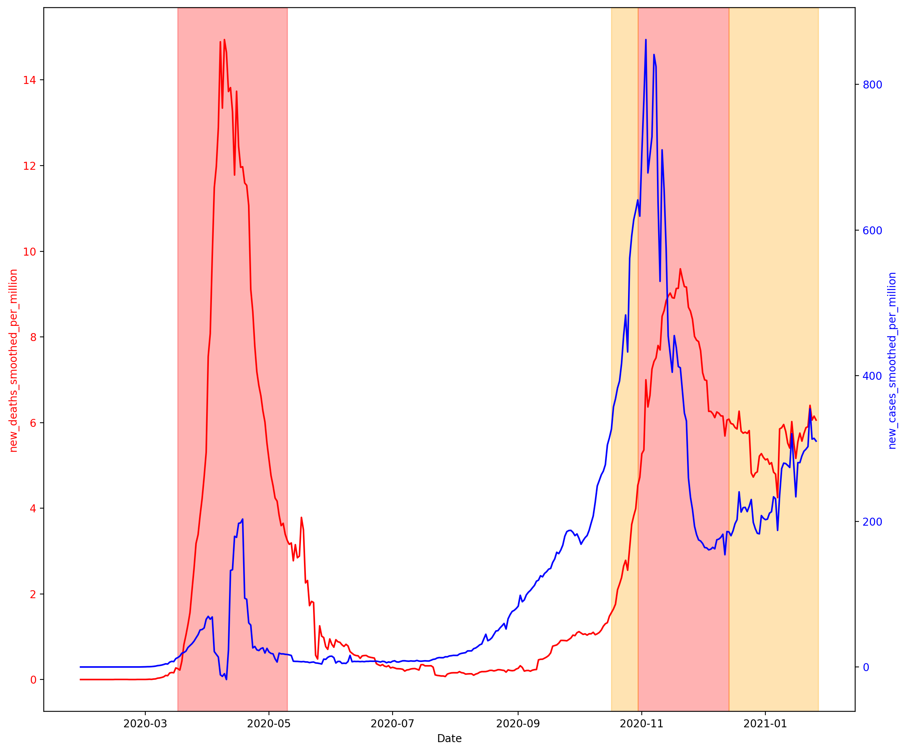

# covid-data

COVID-data is a series of Jupyter Notebooks to parse COVID data coming from [
Our World in Data](https://ourworldindata.org). Data displayed here is mostly about France, but this is made to be easily adapatable to any other countries.

You can find here :
* New confirmed cases of COVID-19 (7-day smoothed) per 1,000,000 people by country: [COVID Cases](https://github.com/simonmoreau/covid-data/blob/main/COVID%20Cases.ipynb)
* The total deaths attributed to COVID-19 per 1,000,000 people: [COVID Death](https://github.com/simonmoreau/covid-data/blob/main/COVID%20Death.ipynb)
* The total number of COVID-19 vaccination doses administered per 100 people in the total population by country: [COVID Vaccine](https://github.com/simonmoreau/covid-data/blob/main/COVID%20Vaccine.ipynb)
* The new confirmed cases of COVID-19 and the new deaths attributed to COVID-19 (7-day smoothed) per 1,000,000 people, along the lockdowns periods: [COVID Lockdown Effect](https://github.com/simonmoreau/covid-data/blob/main/COVID%20Lockdown%20Effect.ipynb)

## Built With

* [Jupyter Notebook](https://jupyter.org/)

## Development

Want to contribute? Great, I would be happy to integrate your improvements!

To fix a bug or enhance an existing module, follow these steps:

- Fork the repo
- Create a new branch (`git checkout -b improve-feature`)
- Make the appropriate changes in the files
- Add changes to reflect the changes made
- Commit your changes (`git commit -am 'Improve feature'`)
- Push to the branch (`git push origin improve-feature`)
- Create a Pull Request

## Bug / Feature Request

If you find a bug (connection issue, error while uploading, ...), kindly open an issue [here](https://github.com/simonmoreau/covid-data/issues/new) by including a screenshot of your problem and the expected result.

If you'd like to request a new function, feel free to do so by opening an issue [here](https://github.com/simonmoreau/covid-data/issues/new). Please include workflows samples and their corresponding results.

## License

This project is licensed under the MIT License - see the [LICENSE.md](LICENSE.md) file for details

## Contact information
This software is an open-source project mostly maintained by myself, Simon Moreau. If you have any questions or request, feel free to contact me at [simon@bim42.com](mailto:simon@bim42.com) or on Twitter [@bim42](https://twitter.com/bim42?lang=en).

